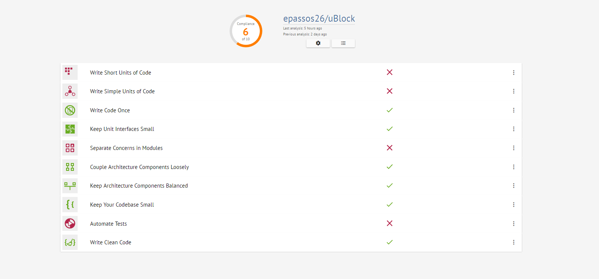

# Relatório 5 - Manutenção e evolução do *software*

## Índice
1. [Introdução](#introducao)
1. [Manutenção do software](#manutencao)
1. [Implementação da feature](#implementacao)
1. [Pull request](#pull)

<a name="introducao"/>
## Introdução
Na engenharia de *software*, a manutenção ou evolução é um processo de otimização e melhoria de um projeto já antes desenvolvido. Estas melhorias podem ir desde, melhoria de funcionalidades,novas funcionalidades, correção e prevenção de erros até a adaptação do programa a diferentes mudanças do sistema.

Durante a realização deste processo, temos de ter em conta que as alterações a ser realizadas, não vão afetar negativamente o programa, realizando alterações apenas nas partes pretendidas do *software*.

Ao longo do tempo é inevitável estas alterações do software devido aos seguintes factos,
* Novos requisitos que surgem quando o *software* é utilizado.
* O ambiente de negócios muda.
* Erros que são descobertos e a necessidade de seem reparados.
* Novos computadores e equipamentos são adicionados ao sistema.
* O desempenho ou a confiabilidade do *software* podem ter de ser melhorados.

Um problema chave para todas as organizações com estes tipo de projetos, é gerir a implementação de alterações no *software*.

<a name="manutencao"/>
## Manutenção do software
Como forma de avaliar a qualidade do *uBlock*, foi utilizado a ferramenta [Better Code Hub](https://bettercodehub.com/results/epassos26/uBlock), ferramenta a qual permite avaliar vários fatores do projeto, como a legibilidade e capacidade de evolução.

Com a execução da ferramenta no nosso projeto, podemos verificar que nem todas as métricas tiveram aprovação sendo que de 10, 4 falharam e 6 foram aprovadas.

## Implementação da feature

## *Pull Request*
