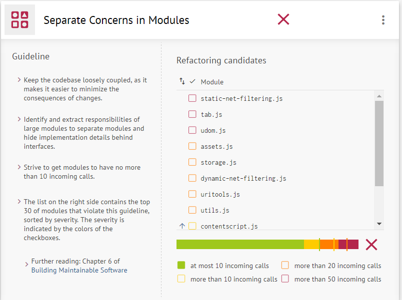

# Relatório 5 - Manutenção e evolução do *software*

## Índice
1. [Introdução](#introducao)
1. [Manutenção do software](#manutencao)
1. [Implementação da feature](#implementacao)
1. [Pull request](#pull)

<a name="introducao"/>
## Introdução
Na engenharia de *software*, a manutenção ou evolução é um processo de otimização e melhoria de um projeto já antes desenvolvido. Estas melhorias podem ir desde, melhoria de funcionalidades,novas funcionalidades, correção e prevenção de erros até a adaptação do programa a diferentes mudanças do sistema.

Durante a realização deste processo, temos de ter em conta que as alterações a ser realizadas, não vão afetar negativamente o programa, realizando alterações apenas nas partes pretendidas do *software*.

Ao longo do tempo é inevitável estas alterações do software devido aos seguintes factos,
* Novos requisitos que surgem quando o *software* é utilizado.
* O ambiente de negócios muda.
* Erros que são descobertos e a necessidade de seem reparados.
* Novos computadores e equipamentos são adicionados ao sistema.
* O desempenho ou a confiabilidade do *software* podem ter de ser melhorados.

Um problema chave para todas as organizações com estes tipo de projetos, é gerir a implementação de alterações no *software*.

<a name="manutencao"/>
## Manutenção do software
Como forma de avaliar a qualidade do *uBlock*, foi utilizado a ferramenta [Better Code Hub](https://bettercodehub.com/results/epassos26/uBlock), ferramenta a qual permite avaliar vários fatores do projeto, como a legibilidade e capacidade de evolução.

Com a execução da ferramenta no nosso projeto, podemos verificar que nem todas as métricas tiveram aprovação sendo que de 10, 4 falharam e 6 foram aprovadas.

Como podemos verificar pela análise do [Better Code Hub](https://bettercodehub.com/results/epassos26/uBlock) no que toca ao nível da escrita do código, a aplicação falha em 2 de 3 métricas, sendo estas a escrita de pequenas unidades de código (***Write Short Units of Code***) e a escrita de unidades simples de código (***Write Short Units of Code***). Ao analisarmos estas métricas, podemos verificar que a análise é bem realizada, uma vez que para a métrica ***Write Simple Units of Code*** o programa reprova tendo um resultado bastante negativo uma vez que são dados o top 30 de ficheiros que ultrapassam o limite de linha definido pelo *Better Code Hub*, sendo que, o último ficheiro do top, possuí cerca de 5 vezes o código limite e o primeiro do top tem cerca de 36 vezes mais. Este resultado deve-se, provavelmente, ao facto de ser um aplicação *web* em que o proprietário possuí ,mais ou menos, um ficheiro para cada função da aplicação sendo que existe funções que devido a complexidade deveriam ser separadas em outras mais funções de forma a tornar o o código de cada função mais pequeno, de forma a ser mais legível o programa.

Relativamente a métrica ***Write Simple Units of Code***, a verificação de aprovação ou reprovação é determinada pela complexidade ciclomática (*McCabe complexity*), sendo que o programa reprova também nesta métrica pois possuí vários *branch points* o que torna a complexidade ciclomática acima do limite determinado pelo *Better Code Hub*. Devido a este resultado negativo, podemos verificar que se trata de um código cuja a alteração e testabilidade e torna mais complexa.

**Cálculo da complexidade ciclomática**:

Quanto a métrica ***Write Code Once*** a aplicação obteve um resultado positívo, o que leva a conclusão que em caso de *bugs* ou alterações de código, esta ação se torna mais simples uma vez que não havendo grande quantidade de código duplicado, exige apenas a alteração de este apenas uma vez.

Nas métricas seguintes, a aplicação apenas obteve resultado negativo em mais duas (na métrica ***Separate Concerns in Modules*** e na métrica ***Automate Tests***). Relativamente a métrica ***Separate Concerns in Modules*** a aplicação reprova uma vez que vários módulos são chamados por parte de outros,
o que torna mais complicado a alteração em certos módulos uma vez que a sua alteração pode provocar consequentes alterações que não são necessárias noutros que fazem uso do que foi alterado. Podemos verificar assim que a aplicação não possuí uma boa separação de responsabilidades.

Quanto a métrica ***Automate Tests***, apesar o *Better Code Hub* não detetar teste automatizados o que leva a reprovação desta métrica, o *uBlock* faz uso do [*Travis CI*](https://travis-ci.org/) para a realização de testes sempre que é realizado um *push* para o repositório. No caso do *uBlock* os testes realizados são *scripts* em que é realizada a simulação da aplicação em diferentes browsers como o *Chrome*, *WebExt* e *Firefox*.

Nas restantes métricas por analisar, podemos concluir através da métrica ***Keep Unit Interfaces Small*** que a aplicação é aprovada com facilidade uma vez que a função com mais parâmetros da aplicação possuí quatro parâmetros e o limite establecido pelo *Better Code Hub* é de dois parâmetros. Isto torna o código de melhor compreensão e uma maior flexibilidade no sentido de reúso. Através das métricas ***Couple Architecture Components Loosely*** e ***Keep Architecture Components Balanced*** podemos verificar que a aplicação possuí uma boa arquitectura nas componentes separando as componentes de diferentes níveis, sendo que a separação nos diferentes níveis é realizada de forma uniforme, facilitando a manutenção das componentes assim como a localização do código. Com a aprovação nas métricas ***Keep Your Codebase Small*** e ***Write Clean Code*** o que permiti também concluir que o código possuí poucos *code smells* assim como pouco código morto (código que não tem utilidade).

<a name="implementacao"/>
## Implementação da *feature*

Ao navegar pelos *issues* do projeto, o grupo encontrou um [*issue*](https://github.com/gorhill/uBlock/issues/2224) que achou interessante resolver.
O utilizador *WillPittenger* que mudou do *AdBlock Latitude* para o *uBlock Origin* reparou que este não tinha atalhos, de modo a facilitar a navegação.

Tendo isto em conta, o grupo implementou um atalho que liga o *Element Picker* de modo a selecionar que elementos de uma página o utilizador tenciona remover.

Recentemente, o Firefox alterou a maneira como suporta atalhos para extensões, tendo migrado para uma maneira semelhante à do Google Chrome - através de um *manifest.json*.
Contudo, o ficheiro de configurações do uBlock para o Firefox ainda tem o sistema antigo de configuração. Devido a este facto, o grupo não conseguiu encontrar informação sobre como implementar esta *feature* no Firefox.
Apesar deste contra-tempo, o grupo conseguiu implementar o atalho para os browsers Opera, Google Chrome e para os navegadores que seguem o protocolo WebExt.

<a name="pull"/>
## *Pull Request*

Após ter finalizado a implementação, o grupo criou um [*pull request*](https://github.com/gorhill/uBlock/pull/2251) para o repositório original.
Infelizmente, o criador não é conhecido por aceitar *pull requests*, tendo explicitamente escrito no [*CONTRIBUTING.md*](https://github.com/gorhill/uBlock/blob/master/CONTRIBUTING.md) que não aceita contribuições.
