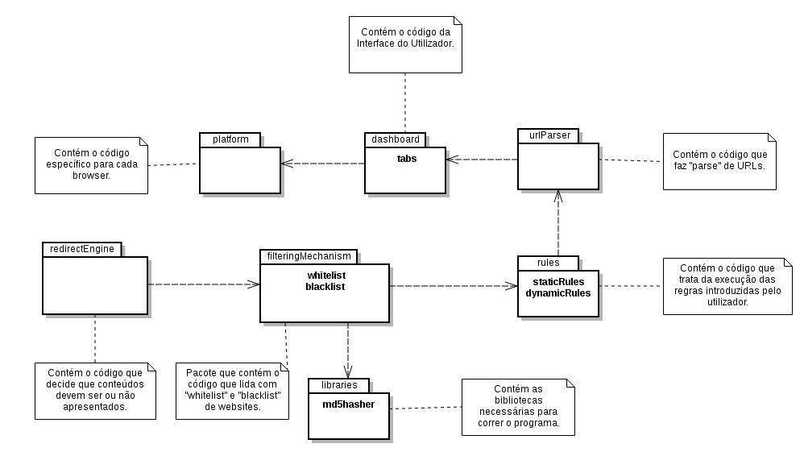
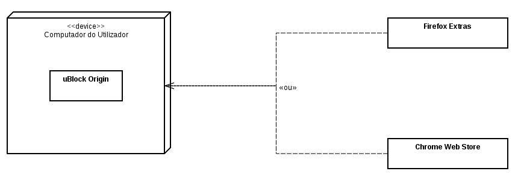
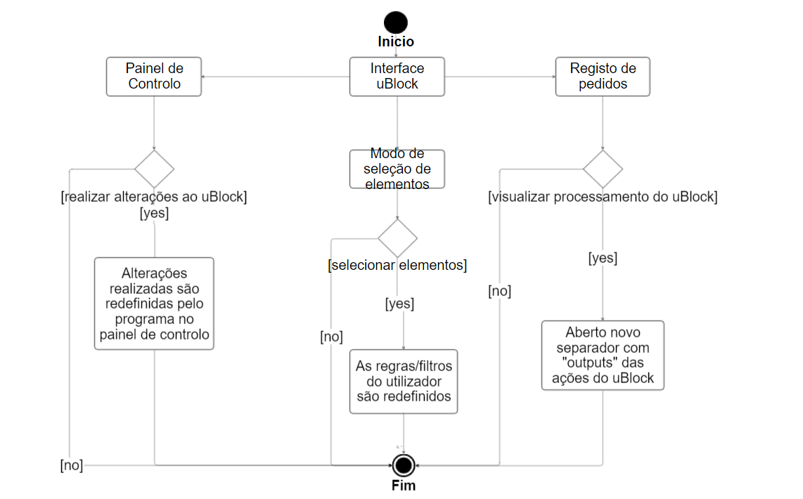

# Relatório 3 - Design de Software

## Índice
1. [Introdução à Arquitetura de Software e ao Modelo de Arquitetura 4 + 1](#introducao)
1. [Vista Lógica](#logica)
1. [Vista de Desenvolvimento](#desenvolvimento)
1. [Vista de Distribuição](#deployment)
1. [Vista de Processo](#processo)

## Introdução à Arquitetura de Software e ao Modelo de Arquitetura 4 + 1

O *uBlock Origin*, através da utilização das várias tecnologias *web* usadas atualmente, implementa o Padrão Model-View-Controller.

A parte *View* do programa é implementado utilizando *HTML* e *CSS*, que permite moldar a embelezar a parte visual da extensão. Para os *Controller* e *Model* é utilizado *JavaScript* dando a possibilidade de editar as páginas dinamicamente e separando a lógica da interface.

## Vista Lógica

O *uBlock Origin* apresenta-se com os seguintes pacotes, de modo a organizar o código de maneira lógica:

O programa baseia-se no *redirect engine*, que é o motor que decide que conteúdos serão ou não apresentados. Para isto, é necessário um mecanismo de filtragem de *scripts* considerados malignos ou indesejados.

Este mecanismo precisa de saber que *URLs* bloquear. Como tal, são necessárias regras que, dependendo se estão ou não na *whitelist* ou *blacklist*, permitirão ou bloquearão a transferências de conteúdo de *websites*. De modo a criar uma aplicação personalizável, além das regras estáticas, existem as regras dinâmicas, que permitem bloquear certos *downloads* indesejados, com base nas condições fornecidas pelo utilizador.

A possibilidade do utilizador inserir regras próprias cria um problema de transformar a informação introduzida em informação utilizável pelo computador. Com o intuito de resolver esse problema, o criador do projeto criou um *parser* de *URLs* que permite a criação de regras.

A interface do programa é representada pelo pacote *dashboard* que é o código que permite ao utilizador interagir com o *uBlock*. Esta extensão deve funcionar com vários navegadores de *internet* diferentes. Como tal, existe um pacote *platform* que permite o projeto correr nos vários *browser*.

## Vista de Desenvolvimento

## Vista de Distribuição

Abaixo está apresentado o diagrama da vista de distribuição.

A partir desta imagem, é possível perceber que a extensão é obtida através da *Chrome Web Store* ou da loja de Extras do *Firefox*. O programa corre unicamente no sistema do utilizador, não tendo qualquer outra ligação externa.

## Vista de Processo
Para serem mais percetíveis as interações entre processos do sistema, de acordo com as ações que são pedidas/realizadas, foi criado o seguinte diagrama da vista de processo.

O início do programa é a interface deste e, partir deste estado podem ser tomadas três decisões distintas.

Na situação do painel de controlo, existem várias atividades possíveis de se realizar, desde aceder às definições, até à gestão de filtros e *whitelist*.
Na situação das definições, o programa guarda as alterações que o utilizador deseja e, de seguida, despoleta uma sincronização do DOM (*Document Object Model*), forçando uma atualização da página.
Quando existe uma alteração na lista de filtros, o programa espera pela confirmação do utilizador. Quando as mudanças forem validadas, a extensão atualiza a lista de *URLs* a bloquear.
Relativamente à *whitelist* (lista de servidores para os quais o *uBlock* será desativado), quando lhe é adicionado um *URL* novo e as alterações confirmadas, a aplicação atualiza a sua lista de permissões internamente.  

A atividade de seleção de elementos permite ao utilizador criar filtros baseados em *tags HTML* (cosméticos) ou focados em *URLs*(de rede).
Em ambas as ocasiões, o programa pesquisa pela área da página selecionada e fá-la sobressair. Simultaneamente, é aberta uma caixa no canto inferior direito que permite selecionar que tipo de filtros serão adicionados ao já existentes.

No caso de registo de pedidos é possível inspecionar os pedidos de rede, quer sejam bloqueados ou permitidos.
O programa gere por ordem de chegada e mostra, individualmente, cada acontecimento com que a extensão tenha interagido. É possível verificar, em cada linha, o filtro que executou a ação, o elemento filtrado ou permitido e o *URL* correspondente.
